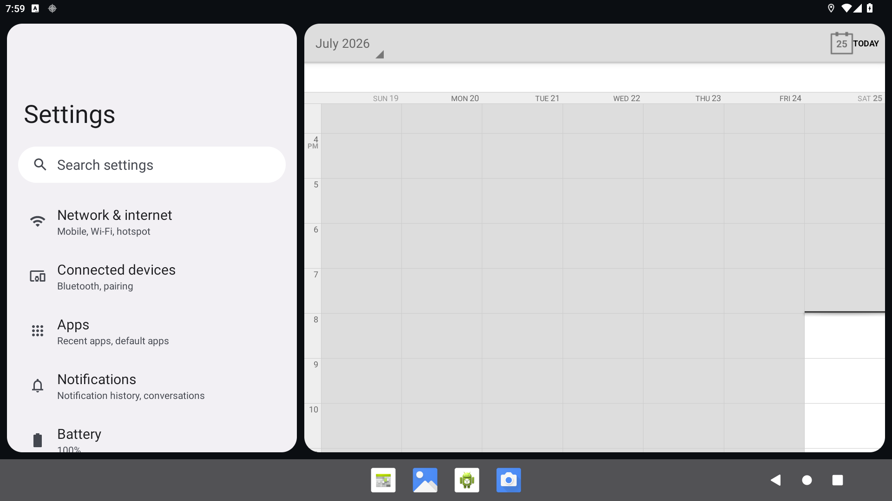
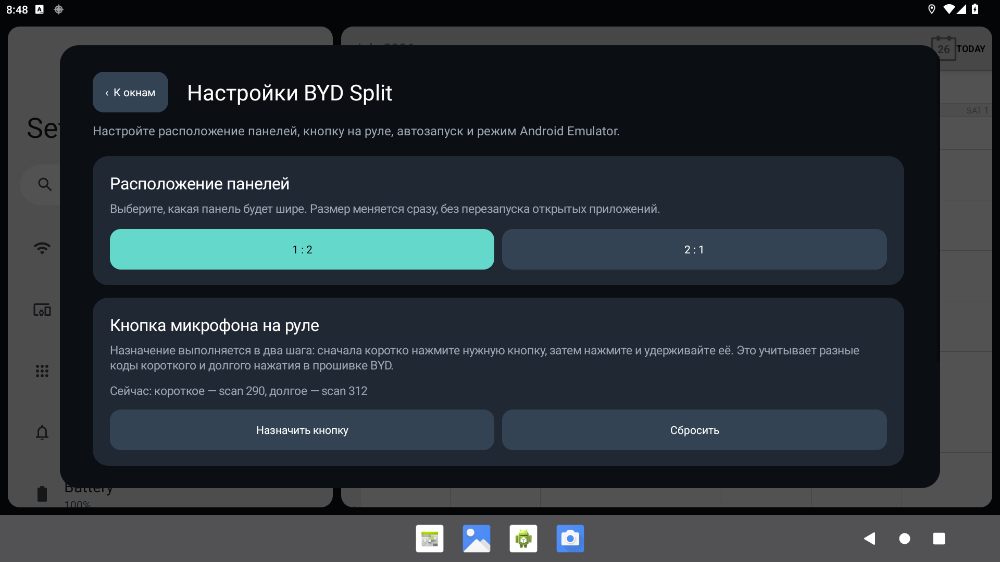

# BYD Split

[](LICENSE)
[](https://github.com/hix83/BYD-Split/actions/workflows/android.yml)

BYD Split — экспериментальный ландшафтный лаунчер для BYD DiLink 5. Он
одновременно показывает два выбранных Android-приложения в собственных
интерактивных областях. Пропорцию можно выбрать готовой (`1:2` или `2:1`)
либо плавно изменить перетаскиванием разделителя.

Проект не использует штатный Android split-screen. Для каждого приложения
создаётся отдельный виртуальный дисплей, поэтому отсутствует системный
разделитель, сохраняются скруглённые панели и можно независимо менять
приложение только в одном окне.

> Статус: версия `0.5.0`, тестируется на DiLink 5 / Android 12. Перед поездкой
> настройте интерфейс на стоящем автомобиле.

## Скриншоты

| Два окна | Настройки |
| --- | --- |
|  |  |

Скриншоты сделаны на Android Emulator с тестовыми приложениями и не содержат
личных переписок или геопозиции.

## Возможности

- две области с готовой пропорцией `1:2` / `2:1` и перетаскиваемым
  разделителем; выбранный размер сохраняется;
- несколько приложений в каждой области, горизонтальное переключение между
  ними и индикатор страниц внизу;
- закрытие приложения перетаскиванием его карточки в корзину после
  двухсекундного удержания по центру области;
- встроенный выбор нового приложения при свайпе за первую или последнюю
  страницу карусели;
- выбор установленных приложений непосредственно в нужной панели;
- сохранение выбора между запусками;
- независимая смена приложения без перезапуска соседней панели;
- сохранение задач обоих приложений при временном открытии камер, системных
  настроек и других полноэкранных программ;
- собственные виртуальные дисплеи вместо системного split-screen;
- непрерывные касания `DOWN / MOVE / UP`, свайпы и long press;
- мультитач и pinch-to-zoom двумя пальцами;
- скрываемое меню «Назад / Изменить / Настройки», открываемое свайпом вниз
  от верхней кромки панели;
- модальное окно настроек без остановки приложений в панелях;
- встроенный ADB-клиент с постоянным RSA-ключом;
- автоматический запуск вспомогательных shell-процессов и службы
  специальных возможностей;
- автозапуск BYD Split после загрузки или быстрого пробуждения DiLink;
- управление голосовыми сообщениями MAX кнопкой микрофона на руле;
- двухэтапное назначение кнопки руля под конкретную модель и прошивку;
- режим Android Emulator с реальными установленными приложениями и без
  BYD-специфичных функций.

## Как работает встроенный ADB

Обычный APK не может выдать себе UID `shell`, читать `/dev/input/event*`,
внедрять системные события ввода или запускать чужую Activity на приватном
виртуальном дисплее. Это ограничение безопасности Android, а не недостающее
runtime-разрешение.

Поэтому решение состоит из двух частей:

1. APK рисует интерфейс, создаёт виртуальные дисплеи и хранит настройки.
2. Встроенный ADB-клиент подключается только к `127.0.0.1:5555` и запускает
   два локальных помощника под UID `shell`.

При первом запуске приложение создаёт 2048-битную RSA-пару в своём приватном
каталоге. DiLink показывает стандартное окно «Разрешить отладку по USB».
Выберите «Всегда разрешать» и подтвердите. Ключ сохраняется между обновлениями
APK, а после перезагрузки BYD Split самостоятельно переподключается и поднимает
помощники. Компьютер для дальнейших запусков не требуется.

При удалении приложения приватный ADB-ключ также удаляется, поэтому после новой
установки подтверждение потребуется повторно.

## Необходимые разрешения

| Разрешение или настройка | Зачем | Как выдаётся |
| --- | --- | --- |
| Установка неизвестных приложений | Установка APK через файловый менеджер | В системном диалоге для конкретного файлового менеджера |
| USB- или беспроводная отладка | Встроенное соединение с локальным `adbd` | В параметрах разработчика + однократное подтверждение RSA-ключа приложения |
| Специальные возможности: «Кнопка микрофона BYD Split» | Определение открытого чата MAX и обработка кнопки руля | Включается автоматически встроенным ADB-клиентом при запуске помощника руля |
| `RECEIVE_BOOT_COMPLETED` | Автозапуск интерфейса | Выдаётся Android автоматически при установке |
| `INTERNET` | Локальные TCP-соединения с помощниками | Выдаётся Android автоматически при установке |

BYD Split не запрашивает микрофон, геолокацию, контакты, файлы и разрешение
«Поверх других окон». Выбранные приложения самостоятельно запрашивают нужные им
разрешения.

## Штатная установка APK

Этот способ устанавливает само приложение через интерфейс DiLink:

1. Соберите или скачайте `app-debug.apk`.
2. Скопируйте APK на USB-накопитель либо загрузите его на головное устройство.
3. Откройте APK штатным файловым менеджером.
4. Если Android попросит, разрешите этому файловому менеджеру установку
   неизвестных приложений.
5. Подтвердите установку и запустите BYD Split.
6. При первом открытии подтвердите штатный запрос ADB, отметив
   «Всегда разрешать».
7. Помощники и служба специальных возможностей для MAX будут настроены
   автоматически.

На некоторых версиях DiLink штатный установщик сторонних APK заблокирован
политикой прошивки. В таком случае используйте установку через ADB.

## Установка одной командой через ADB

Требования на компьютере:

- Android Platform Tools (`adb`);
- JDK 17;
- Android SDK 35 для сборки из исходников;
- включённая отладка на DiLink и подтверждённый RSA-ключ компьютера.

Проверьте подключение:

```sh
adb connect 10.14.32.18:5555
adb devices -l
```

Из корня проекта выполните:

```sh
./tools/install_and_start.sh 10.14.32.18:5555
```

Скрипт предназначен для разработки и:

1. собирает debug APK;
2. устанавливает или обновляет приложение;
3. при необходимости запускает резервный loopback-мост;
4. открывает BYD Split.

Если APK уже собран и его не нужно пересобирать:

```sh
BYD_SPLIT_SKIP_BUILD=1 ./tools/install_and_start.sh 10.14.32.18:5555
```

В обычной эксплуатации после перезагрузки никакие команды выполнять не нужно.
Если встроенный ADB не поддерживается конкретной прошивкой, остаётся резервный
запуск с компьютера:

```sh
./tools/start_adb_bridge.sh 10.14.32.18:5555
```

Проверка всех помощников:

```sh
./tools/check_status.sh 10.14.32.18:5555
```

## Использование

1. Нажмите плитку приложения в левой или правой панели.
2. Выберите программу из встроенной сетки.
3. Для управления панелью проведите вниз от её верхней границы.
4. Используйте:
   - `‹` для события «Назад» внутри выбранного виртуального дисплея;
   - «Изменить» для замены приложения только в этой панели;
   - `⚙` для модальных настроек.
5. Для масштабирования используйте обычный жест двумя пальцами.
6. Чтобы закрыть текущее приложение, удерживайте палец по центру области
   2 секунды. После уменьшения карточки перетащите её вниз в корзину.
   Слева от удалённого приложения выбирается предыдущая страница; если её
   нет — следующая. Отпускание вне корзины отменяет закрытие.

Выбор обеих программ хранится в `SharedPreferences`.

## Кнопка микрофона и MAX

На протестированной ревизии DiLink 5 по умолчанию используются низкоуровневые
события `scan 312` для долгого и `scan 290` для короткого нажатия:

1. Откройте чат в MAX.
2. Долгое нажатие на руле запускает запись и медленно переводит её в режим
   фиксации движением к замку.
3. Первое короткое нажатие останавливает запись.
4. На экране подтверждения один короткий клик отправляет сообщение, а двойной
   короткий клик удаляет его. Одиночный клик выполняется после окна ожидания
   двойного нажатия около 0,55 секунды.

Вне открытого чата MAX событие не перехватывается и остаётся штатному голосовому
помощнику BYD. Коды и координаты могут отличаться на другой ревизии прошивки.

Если коды отличаются, откройте `Настройки → Кнопка микрофона на руле` и нажмите
«Назначить кнопку». Сначала коротко нажмите нужную кнопку, затем нажмите и
удерживайте её. Оба кода сохраняются, а помощник руля автоматически
перезапускается. Номер `/dev/input/event*` запоминать не нужно: BYD Split при
каждом запуске находит устройство `simulate-keys` по системному имени.

## Настройки

Откройте меню любой панели свайпом вниз и нажмите `⚙`. В модальном окне можно:

- поменять расположение панелей между `1:2` и `2:1` без перезапуска
  открытых приложений; произвольный размер задаётся перетаскиванием
  разделителя на главном экране;
- назначить кнопку руля двухэтапным коротким и долгим нажатием;
- включить или выключить автозапуск;
- включить режим Android Emulator.

ADB-помощники запускаются автоматически при старте BYD Split. При первой
авторизации системный диалог ADB появляется сам; отдельные диагностические
кнопки не требуются.

Автозапуск реагирует как на полную загрузку Android (`BOOT_COMPLETED`), так и
на быстрое пробуждение DiLink (`QUICKBOOT_POWERON`). `USER_PRESENT` используется
как резервный сигнал. Поскольку Android 12 может создать Activity в фоне, но
оставить поверх неё штатный лаунчер, авторизованный локальный ADB-клиент
дополнительно выводит BYD Split на передний план от имени `shell`.

## Демо на Android Emulator

Режим эмулятора использует тот же production-код: два приватных виртуальных
дисплея, выбор любых реально установленных на AVD приложений, касания,
мультитач, изменение размеров и карусели приложений. Скрипт запускает
стандартные Android ADB-помощники, но не запускает обработчик руля и
Accessibility-интеграцию MAX, поскольку этих BYD-компонентов в AVD нет.

Если AVD уже создан:

```sh
BYD_SPLIT_AVD=BYD_AUTO_Dilink5.0_virtual \
  ./tools/run_emulator_demo.sh emulator-5554
```

Если эмулятор уже работает:

```sh
./tools/run_emulator_demo.sh emulator-5554
```

Режим также можно включить вручную в модальных настройках. Для создания нового
AVD в Android Studio используйте Android 12+ и ландшафтное разрешение
`1920 × 1080`.

## Ручная сборка

```sh
export JAVA_HOME="/Applications/Android Studio.app/Contents/jbr/Contents/Home"
export ANDROID_HOME="$HOME/Library/Android/sdk"
./gradlew assembleDebug lintDebug testDebugUnitTest
```

APK:

```text
app/build/outputs/apk/debug/app-debug.apk
```

Для публичного release создайте собственный signing key и настройте
`signingConfig` локально или через секреты GitHub Actions. Ключи и пароли нельзя
добавлять в репозиторий.

## Архитектура

| Компонент | Порт | Назначение |
| --- | ---: | --- |
| `LocalAdbClient` | `5555` | Встроенная ADB-аутентификация и разрешённые shell-команды |
| `byd_split_bridge.sh` | `37527` | Только резервный мост для разработки и восстановления |
| `ShellInputDaemon` | `37528` | Быстрая передача одно- и многопальцевых MotionEvent |
| `SteeringEventServer` | `37529` | Приём событий руля внутри APK |
| `SteeringInputDaemon` | `37530` | Чтение BYD input device и health-check |

Все серверы привязаны к `127.0.0.1`; команды проходят проверку протокола,
аргументов и токена.

## Структура проекта

```text
app/                         Android-приложение
tools/install_and_start.sh   Полная установка и bootstrap
tools/start_adb_bridge.sh    Резервный запуск для несовместимой прошивки
tools/check_status.sh        Проверка трёх локальных компонентов
tools/run_emulator_demo.sh   Запуск демонстрации на AVD
.github/workflows/android.yml CI: сборка, lint и APK-артефакт
docs/screenshots/            Изображения для README
```

## Ограничения

- Подтверждено только на BYD DiLink 5 с Android 12.
- Локальный `adbd` должен быть включён и принимать RSA-аутентификацию; это
  подтверждено на протестированном DiLink 5, но может отличаться в другой
  прошивке.
- Некоторые приложения запрещают запуск на виртуальном дисплее или используют
  защищённое видео; это зависит от самого приложения.
- Обновления MAX могут изменить координаты элементов записи.
- Коды кнопки руля зависят от модели и версии прошивки.

## Подготовка GitHub-релиза

- CI собирает debug APK при каждом push и pull request.
- Для release APK необходимо добавить signing key через секреты, не в Git.
- Не публикуйте скриншоты с личными чатами, контактами и геопозицией —
  используйте тестовые приложения и данные на AVD.

## Лицензия

Исходный код распространяется по
[Apache License 2.0](LICENSE). Разрешены использование, изменение,
распространение и коммерческое применение при соблюдении условий лицензии и
сохранении уведомлений об авторстве. Проект предоставляется без гарантий.

## Благодарности

Идея самостоятельной ADB-аутентификации внутри автомобильного APK была
проверена после изучения архитектуры
[BYDMate-DM](https://github.com/hix83/BYDMate-DM). Реализация ADB-протокола в
BYD Split написана независимо; исходный код BYDMate в проект не копировался.
