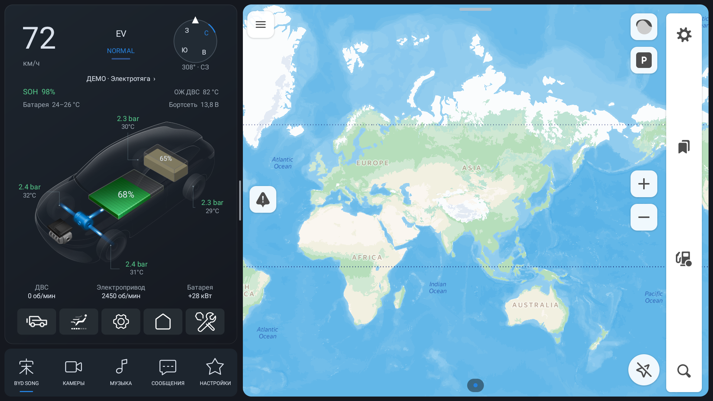
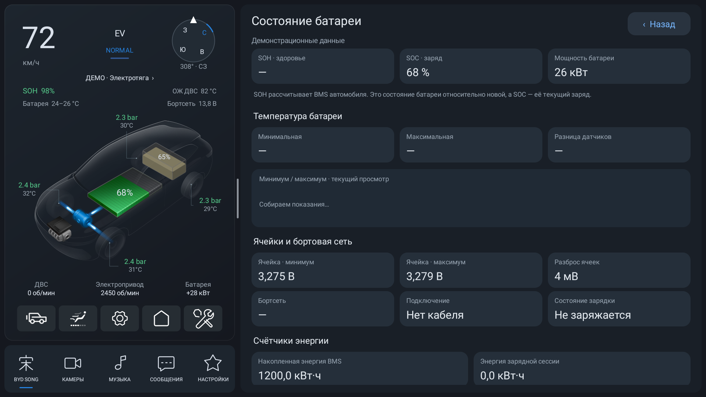
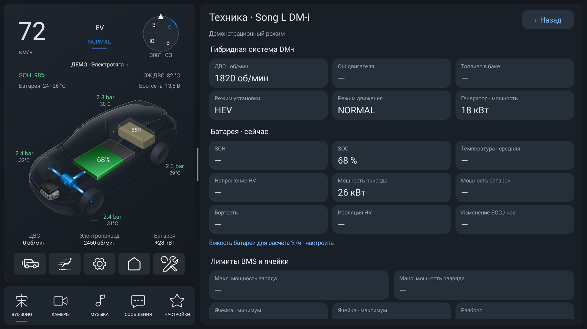
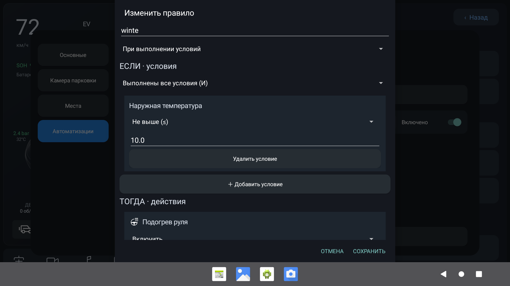
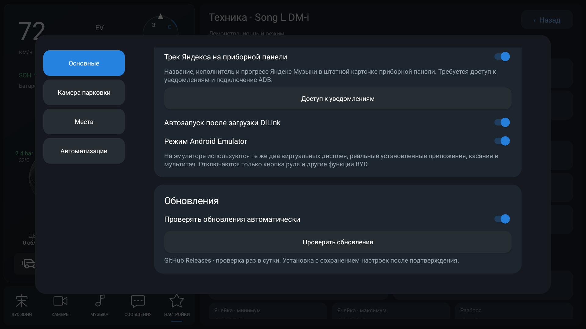

# BYD Split

[](LICENSE)
[](https://github.com/hix83/BYD-Split/actions/workflows/android.yml)

BYD Split — экспериментальный ландшафтный лаунчер для BYD DiLink 5. Он
одновременно показывает служебную автомобильную область и выбранное
Android-приложение. Пропорция зафиксирована как `1:2`, а области можно
целиком поменять местами без перезапуска открытого приложения.

Проект не использует штатный Android split-screen. Для каждого приложения
создаётся отдельный виртуальный дисплей, поэтому отсутствует системный
разделитель, сохраняются скруглённые панели и можно независимо менять
приложение только в одном окне.

> Статус: версия `0.9.1`, тестируется на DiLink 5 / Android 12. Перед поездкой
> настройте интерфейс на стоящем автомобиле.

[Скачать последнюю версию APK](https://github.com/hix83/BYD-Split/releases/latest)

## Версия 0.9.1

- Автоматическая проверка GitHub Releases раз в сутки и ручная проверка в настройках.
- Загрузка обновления, проверка пакета, версии и подписи APK; установка с сохранением настроек через системный установщик.
- Название, исполнитель и прогресс Яндекс Музыки на приборке: переключатель в основных настройках. Проверка на физической приборке ещё требуется.
- Исправлено определение режима Snowfield и потоков DM-i по телеметрии.
- Подключение телефона отложено; в нижнем меню снова пять кнопок.

[Изменения и проверка](docs/releases/v0.9.1.md). APK обновляет 0.9.0 без удаления приложения.

Компоненты, адаптированные из BYDMate, распространяются на условиях PolyForm Noncommercial 1.0.0; см. [уведомления](NOTICE) и лицензию в `app/src/main/assets/BYDMate-LICENSE.txt`.

## Версия 0.9.0

- Интерфейс в стиле UI7, единая схема DM-i, давление шин и уровень топлива.
- SOH и температура батареи, напряжение бортсети, обороты ДВС и электропривода.
- Подробности батареи по нажатию SOH и экран техники по кнопке с инструментами.
- Конструктор автоматизаций: температура снаружи/в салоне, геозоны, действия,
  уровни, таймеры и проверка правил; места выбираются на карте.
- Значок климата показывает скорость вентилятора и направления обдува.
- Обработка звонков MAX во встроенной области и скрытие клавиатуры по «Назад».

Температура ОЖ на проверенной машине пока недоступна. Команды подогрева,
вентиляции и сценарии геозон требуют дальнейшей проверки на автомобиле.
Первое полноэкранное появление звонка MAX полностью исключить пока нельзя.
Подробности и ограничения — в [примечаниях к релизу](docs/releases/v0.9.0.md).

## Скриншоты 0.9.1

Снимки из Android Emulator. Показания автомобиля демонстрационные; карта не показывает местоположение владельца.

### Автомобиль и приложения



### Батарея и техника

| Подробности батареи по нажатию на SOH | Техника и гибридная система |
| --- | --- |
|  |  |

### Автоматизации и обновления

| Конструктор правил | Настройки обновлений |
| --- | --- |
|  |  |

## Возможности

### Две независимые области

Служебная область занимает треть экрана, основное приложение — две трети. Области можно поменять местами. Приложения запускаются на отдельных виртуальных дисплеях с поддержкой касаний, свайпов, удержания и мультитача.

Нижний док содержит пять кнопок: BYD SONG, камеры, музыка, сообщения и настройки. Для музыки и сообщений можно назначить свои приложения. В каждой области доступны карусель приложений, выбор нового приложения и закрытие карточки через корзину. Выбор сохраняется между запусками.

### Состояние автомобиля в стиле UI7

- Единая изометрическая схема DM-i: ДВС, электропривод, батарея и топливный бак; направления потоков энергии зависят от телеметрии.
- Давление и температура шин, заряд и уровень топлива в процентах, скорость и компас.
- SOH, температура батареи, напряжение бортсети, обороты ДВС и электропривода. Для недоступных показаний выводится прочерк.
- Режимы движения, включая Snowfield.
- Значок климата с индикацией скорости вентилятора и направлений обдува; быстрые кнопки автомобиля, климата, системных настроек, домашнего экрана и техники.

### Подробности батареи и техники

Нажатие на SOH открывает страницу батареи в правой области: SOC и SOH, мощность батареи, температуры и их график, напряжения ячеек и разброс, состояние зарядки и счётчики энергии BMS.

Кнопка с инструментами открывает страницу техники: гибридная система, батарея, зарядка и другие доступные параметры автомобиля. Состав фактических показаний зависит от модели и прошивки. Показания температуры ОЖ на проверенной машине пока недоступны.

### Автоматизации и места

Правило собирается из условий и действий. Условия можно объединить по принципу «все» или «любое»:

- температура снаружи;
- температура в салоне;
- въезд в выбранную геозону.

Действия: подогрев руля, подогрев и вентиляция водительского и пассажирского сидений с выбором уровня, выключение и открытие камеры. Для прогрева доступны однократный запуск и таймер. Въезд в зону срабатывает один раз до следующего выезда и повторного въезда.

Места выбираются нажатием на карту с названием и радиусом, по умолчанию 50 метров. Правила отображаются компактными строками с редактированием, удалением и переключателем активности. «Проверить правила» открывает отдельное окно симуляции; реальные команды на машине требуют проверки.

### Трек Яндекса на приборке

Настройки → Основные → **Трек Яндекса на приборной панели**. Название, исполнитель (при поддержке прошивки), состояние воспроизведения и прогресс Яндекс Музыки и музыки Яндекс Навигатора передаются в штатную музыкальную карточку приборки. Требуются ADB и доступ к уведомлениям. По умолчанию выключено. Обложка не передаётся; отображение на физической приборке ещё предстоит проверить.

### Обновления из GitHub

Автоматическая проверка [GitHub Releases](https://github.com/hix83/BYD-Split/releases/latest) выполняется раз в сутки. В Настройки → Основные → **Обновления** можно отключить автопроверку или проверить вручную.

После подтверждения APK загружается по HTTPS. Проверяются пакет, версия, подпись и контрольная сумма GitHub при наличии. Android открывает системный установщик; при первой установке может потребоваться разрешение для BYD Split. Настройки сохраняются. Полный цикл обновления проверен в эмуляторе. На 0.9.1 с более ранних выпусков нужно перейти вручную — затем обновления доступны из приложения.

### Интеграция с DiLink

- Встроенный ADB-клиент с постоянным RSA-ключом и запуском помощников.
- Автозапуск после загрузки и быстрого пробуждения, отключаемый полноэкранный режим.
- Двухэтапное назначение кнопки микрофона руля, управление голосовыми сообщениями MAX и переключение приложений стрелками руля.
- Маршрутизация звонков MAX во встроенную область; первое полноэкранное появление вызова пока полностью не исключено.
- Скрытие клавиатуры кнопкой «Назад».
- Режим эмулятора с реальными приложениями и демонстрационной телеметрией.

Подключение телефона по ICCOA/Carlink отложено: шестая кнопка скрыта, материалы сохранены для дальнейшей работы.

## Как работает встроенный ADB

Обычный APK не может выдать себе UID `shell`, читать `/dev/input/event*`,
внедрять системные события ввода или запускать чужую Activity на приватном
виртуальном дисплее. Это ограничение безопасности Android, а не недостающее
runtime-разрешение.

Поэтому решение состоит из двух частей:

1. APK рисует интерфейс, создаёт виртуальные дисплеи и хранит настройки.
2. Встроенный ADB-клиент подключается только к `127.0.0.1:5555` и запускает
   два локальных помощника под UID `shell`.

При первом запуске приложение создаёт 2048-битную RSA-пару в своём приватном
каталоге. DiLink показывает стандартное окно «Разрешить отладку по USB».
Выберите «Всегда разрешать» и подтвердите. Ключ сохраняется между обновлениями
APK, а после перезагрузки BYD Split самостоятельно переподключается и поднимает
помощники. Компьютер для дальнейших запусков не требуется.

При удалении приложения приватный ADB-ключ также удаляется, поэтому после новой
установки подтверждение потребуется повторно.

## Необходимые разрешения

| Разрешение или настройка | Зачем | Как выдаётся |
| --- | --- | --- |
| Установка неизвестных приложений | Установка APK через файловый менеджер | В системном диалоге для конкретного файлового менеджера |
| USB- или беспроводная отладка | Встроенное соединение с локальным `adbd` | В параметрах разработчика + однократное подтверждение RSA-ключа приложения |
| Специальные возможности: «Кнопка микрофона BYD Split» | Определение открытого чата MAX и обработка кнопки руля | Включается автоматически встроенным ADB-клиентом при запуске помощника руля |
| `RECEIVE_BOOT_COMPLETED` | Автозапуск интерфейса | Выдаётся Android автоматически при установке |
| `INTERNET` | Локальные TCP-соединения с помощниками | Выдаётся Android автоматически при установке |

BYD Split не запрашивает микрофон, геолокацию, контакты, файлы и разрешение
«Поверх других окон». Выбранные приложения самостоятельно запрашивают нужные им
разрешения.

## Штатная установка APK

Этот способ устанавливает само приложение через интерфейс DiLink:

1. Соберите или скачайте `app-debug.apk`.
2. Скопируйте APK на USB-накопитель либо загрузите его на головное устройство.
3. Откройте APK штатным файловым менеджером.
4. Если Android попросит, разрешите этому файловому менеджеру установку
   неизвестных приложений.
5. Подтвердите установку и запустите BYD Split.
6. При первом открытии подтвердите штатный запрос ADB, отметив
   «Всегда разрешать».
7. Помощники и служба специальных возможностей для MAX будут настроены
   автоматически.

На некоторых версиях DiLink штатный установщик сторонних APK заблокирован
политикой прошивки. В таком случае используйте установку через ADB.

## Установка одной командой через ADB

Требования на компьютере:

- Android Platform Tools (`adb`);
- JDK 17;
- Android SDK 35 для сборки из исходников;
- включённая отладка на DiLink и подтверждённый RSA-ключ компьютера.

Проверьте подключение:

```sh
adb connect 10.14.32.18:5555
adb devices -l
```

Из корня проекта выполните:

```sh
./tools/install_and_start.sh 10.14.32.18:5555
```

Скрипт предназначен для разработки и:

1. собирает debug APK;
2. устанавливает или обновляет приложение;
3. запускает помощники касаний и кнопок руля;
4. открывает BYD Split.

Если APK уже собран и его не нужно пересобирать:

```sh
BYD_SPLIT_SKIP_BUILD=1 ./tools/install_and_start.sh 10.14.32.18:5555
```

В обычной эксплуатации после перезагрузки никакие команды выполнять не нужно.
Для ручного перезапуска помощников при разработке можно использовать:

```sh
./tools/start_helpers.sh 10.14.32.18:5555
```

Проверка всех помощников:

```sh
./tools/check_status.sh 10.14.32.18:5555
```

## Использование

1. Нажмите плитку приложения в левой или правой панели.
2. Выберите программу из встроенной сетки.
3. Для управления панелью проведите вниз от её верхней границы.
4. Используйте:
   - `‹` для события «Назад» внутри выбранного виртуального дисплея;
   - «Изменить» для замены приложения только в этой панели;
   - `⚙` для модальных настроек.
5. Для масштабирования используйте обычный жест двумя пальцами.
6. Чтобы закрыть текущее приложение, удерживайте палец по центру области
   2 секунды. После уменьшения карточки перетащите её вниз в корзину.
   Слева от удалённого приложения выбирается предыдущая страница; если её
   нет — следующая. Отпускание вне корзины отменяет закрытие.

Выбор обеих программ хранится в `SharedPreferences`.

## Кнопка микрофона и MAX

На протестированной ревизии DiLink 5 по умолчанию используются низкоуровневые
события `scan 312` для долгого и `scan 290` для короткого нажатия:

1. Откройте чат в MAX.
2. Долгое нажатие на руле запускает запись и медленно переводит её в режим
   фиксации движением к замку.
3. Первое короткое нажатие останавливает запись.
4. На экране подтверждения один короткий клик отправляет сообщение, а двойной
   короткий клик удаляет его. Одиночный клик выполняется после окна ожидания
   двойного нажатия около 0,55 секунды.

Вне открытого чата MAX событие не перехватывается и остаётся штатному голосовому
помощнику BYD. Коды и координаты могут отличаться на другой ревизии прошивки.

Если коды отличаются, откройте `Настройки → Кнопка микрофона на руле` и нажмите
«Назначить кнопку». Сначала коротко нажмите нужную кнопку, затем нажмите и
удерживайте её. Оба кода сохраняются, а помощник руля автоматически
перезапускается. Номер `/dev/input/event*` запоминать не нужно: BYD Split при
каждом запуске находит устройство `simulate-keys` по системному имени.

## Настройки

Откройте меню любой панели свайпом вниз и нажмите `⚙`. В модальном окне можно:

- поменять служебную и основную области местами без изменения их ширины и
  без перезапуска открытого приложения;
- назначить кнопку руля двухэтапным коротким и долгим нажатием;
- включить или выключить полноэкранный режим; скрытые системные панели
  временно возвращаются свайпом от края экрана;
- включить или выключить автозапуск;
- включить режим Android Emulator.

ADB-помощники запускаются автоматически при старте BYD Split. При первой
авторизации системный диалог ADB появляется сам; отдельные диагностические
кнопки не требуются.

Автозапуск реагирует как на полную загрузку Android (`BOOT_COMPLETED`), так и
на быстрое пробуждение DiLink (`QUICKBOOT_POWERON`). `USER_PRESENT` используется
как резервный сигнал. Поскольку Android 12 может создать Activity в фоне, но
оставить поверх неё штатный лаунчер, авторизованный локальный ADB-клиент
дополнительно выводит BYD Split на передний план от имени `shell`.

## Демо на Android Emulator

Режим эмулятора использует тот же production-код: два приватных виртуальных
дисплея, выбор любых реально установленных на AVD приложений, касания,
мультитач, изменение размеров и карусели приложений. Скрипт запускает
стандартные Android ADB-помощники, но не запускает обработчик руля и
Accessibility-интеграцию MAX, поскольку этих BYD-компонентов в AVD нет.

Если AVD уже создан:

```sh
BYD_SPLIT_AVD=BYD_AUTO_Dilink5.0_virtual \
  ./tools/run_emulator_demo.sh emulator-5554
```

Если эмулятор уже работает:

```sh
./tools/run_emulator_demo.sh emulator-5554
```

Режим также можно включить вручную в модальных настройках. Для создания нового
AVD в Android Studio используйте Android 12+ и ландшафтное разрешение
`1920 × 1080`.

## Ручная сборка

```sh
export JAVA_HOME="/Applications/Android Studio.app/Contents/jbr/Contents/Home"
export ANDROID_HOME="$HOME/Library/Android/sdk"
./gradlew assembleDebug lintDebug testDebugUnitTest
```

APK:

```text
app/build/outputs/apk/debug/app-debug.apk
```

Для публичного release создайте собственный signing key и настройте
`signingConfig` локально или через секреты GitHub Actions. Ключи и пароли нельзя
добавлять в репозиторий.

## Архитектура

| Компонент | Порт | Назначение |
| --- | ---: | --- |
| `LocalAdbClient` | `5555` | Встроенная ADB-аутентификация и разрешённые shell-команды |
| `ShellInputDaemon` | `37528` | Быстрая передача одно- и многопальцевых MotionEvent |
| `SteeringEventServer` | `37529` | Приём событий руля внутри APK |
| `SteeringInputDaemon` | `37530` | Чтение BYD input device и health-check |

Все серверы привязаны к `127.0.0.1`; команды проходят проверку протокола,
аргументов и токена.

## Структура проекта

```text
app/                         Android-приложение
tools/install_and_start.sh   Полная установка и bootstrap
tools/start_helpers.sh       Ручной перезапуск помощников через ADB
tools/check_status.sh        Проверка помощников касаний и руля
tools/run_emulator_demo.sh   Запуск демонстрации на AVD
.github/workflows/android.yml CI: сборка, lint и APK-артефакт
docs/screenshots/            Изображения для README
```

## Ограничения

- Подтверждено только на BYD DiLink 5 с Android 12.
- Локальный `adbd` должен быть включён и принимать RSA-аутентификацию; это
  подтверждено на протестированном DiLink 5, но может отличаться в другой
  прошивке.
- Некоторые приложения запрещают запуск на виртуальном дисплее или используют
  защищённое видео; это зависит от самого приложения.
- Обновления MAX могут изменить координаты элементов записи.
- Коды кнопки руля зависят от модели и версии прошивки.

## Подготовка GitHub-релиза

- CI собирает debug APK при каждом push и pull request.
- Для release APK необходимо добавить signing key через секреты, не в Git.
- Не публикуйте скриншоты с личными чатами, контактами и геопозицией —
  используйте тестовые приложения и данные на AVD.

## Лицензия

Исходный код распространяется по
[Apache License 2.0](LICENSE). Разрешены использование, изменение,
распространение и коммерческое применение при соблюдении условий лицензии и
сохранении уведомлений об авторстве. Проект предоставляется без гарантий.

## Благодарности

Идея самостоятельной ADB-аутентификации внутри автомобильного APK была
проверена после изучения архитектуры
[BYDMate](https://github.com/AndyShaman/BYDMate). Реализация ADB-протокола в
BYD Split написана независимо; исходный код BYDMate в проект не копировался.
